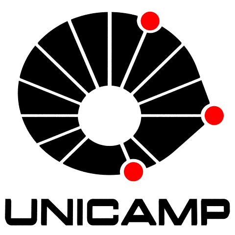

## PORVIR-5G Project

     

[Description](#description) | [Members](#members) | [Publications](#publications) | [News](#news) | [Acknowledgement](#acknowledgement)

## Description

The expected massive growth of mobile Internet traffic in 5G mobile networks introduces the need to change the operators’ networks. Such networks require a drastic transformation towards open, scalable and elastic ecosystems supporting new types of communication. The PORVIR-5G project will develop and demonstrate a programmable fronthaul and backhaul integrating wireless with optical-packet networks and cloud solutions. It is intended to exploit virtual network splits that optimise resource allocation across the wireless, optical, packet, and compute/storage domains. Key enablers for PORVIR-5G are (i) Slicing over packet, wireless, and optical resources, controlled by (ii) deep programmability interfaces, where the devices are configured by network functions to provide the required performance for the future applications on the Internet. This programmability allows a more refined (iii) end-to-end and multilayer orchestration, considering the quality of experience of the users for each type of applications over the network. This project will validate and demonstrate the proposed programmability and virtualization capabilities in three demonstrations, each one of them enabling the key performance demands of 5G networks: an Internet of Things demonstrator focusing on massive machine-type communication; a smart city demonstration for reliable and ultra-low latency flows; and a high bandwidth video demonstrator showcasing the next-generation mobile broadband. 

## Members

        

## Publications

G. Miranda, D. F. Macedo and J. M. Marquez-Barja, <i>"Estimating Video on Demand QoE from Network QoS through ICMP Probes,"</i> in IEEE Transactions on Network and Service Management, doi: <a href="https://doi.org/10.1109/TNSM.2021.3129610">10.1109/TNSM.2021.3129610</a>.

    <strong>Abstract:</strong> With the increasing traffic of vod, network providers are seeking to deliver high qoe for their users. Many methods have been proposed to assess vod-related qoe. Some of them rely on client instrumentation and reporting qoe information to network elements, such as Server and Network Assisted DASH, others are based on statistical methods that make qoe inferences using monitored network conditions, such as throughput and delays. In this article, we present a practical method to estimate qoe for vod using the widely supported icmp probes. Measured network conditions are used as input to a ml model that estimates qoe in terms of mos, based on the ITU-T P.1203 Recommendation. The estimation encompasses video quality switches and playback stalls. We estimate mos with an average rmse of 1.05 for a catalog of 25 different videos, training a model with sessions of the shortest video, and evaluating the generalization to the full catalog. We performed experiments using a virtualized setup as well as in a Wide Area Network.
    <strong>URL:</strong> <a href="https://ieeexplore.ieee.org/stamp/stamp.jsp?tp=&arnumber=9622751&isnumber=5699970">https://ieeexplore.ieee.org/stamp/stamp.jsp?tp=&arnumber=9622751&isnumber=5699970</a>

 

G. Miranda, E. Municio, J. M. Marquez-Barja and D. F. Macedo, <i>"Machine Learning-based End-to-End QoE Monitoring Using Active Network Probing,"</i> in 25th Conference on Innovation in Clouds, Internet and Networks and Workshops (ICIN), 2022, Paris.

    <strong>Abstract:</strong> Abstract here!
    <strong>URL:</strong> To appear

 

T. A. N. do Amaral, R. V. Rosa, D. M. and C. E. Rothenberg, <i>"An In-Kernel Solution Based on XDP for 5G UPF:  Design, Prototype and Performance Evaluation,"</i> in 1st Joint International Workshop on Network Programmability & Automation (NetPA), 2021.

    <strong>Abstract:</strong> Abstract here!
    <strong>URL:</strong> To appear

 

## News

**News #1 - Subject: Post-doctoral fellowship in 5G slicing, orchestration and programmability**
    
We are seeking candidates for a post-doctoral fellowship position for 12 months to work at a joint UFMG-UNICAMP-UFES-UNISINOS-UFRGS project. Due to the number of institutions as well as the situation with COVID-19, there is a great amount of flexibility in the place of work. The candidate will be allocated to one of the host universities and will work with researchers of the consortium. 
This scholarship is part of the Project, entitled “Programmability, Orchestration and Virtualization on 5G networks” (PORVIR-5G), which aims to develop new architectures and mechanisms to improve 5G networks in general. The post-doc candidate will work on the use of AI and machine learning in the orchestration of 5G networks, as well as network slicing and programmability of virtual networks. The project focuses on some of the 5G verticals, namely ultra high quality video, autonomous drones and Industry 4.0. More information at: https://porvir-5g-project.github.io/ 
In order to succeed in this position, you are expected to have:
* Strong motivation;
* A background in computer networks, namely network slicing, programmability;
* Proficient in common computer programming languages (e.g., Java, C/C++, python);
* A background in AI and machine learning is a positive aspect to be considered in the selection process;
* Work experience in research labs abroad, during the Ph.D. period, is a positive aspect to be considered in the selection process;
* Strong problem solving and decision-making skills while using good judgment;
* Good research skills, the ability to work in a team, and communication skills with good written and spoken English are required;
* Experience in preparing/coordinating research project/students team is a plus.

 *** How to apply  ***
Interested candidates should fill the online form https://forms.gle/RKa3e5nfrCPafEVx7 until March 15th, 2022, by adding the documents listed below:
1. A motivation letter for the application;
2. Curriculum vitae, with list of publications, education background, research track-record, and previous experience;
3. Ph.D. degree certificate;
The most suited candidates will be invited for an interview (via videoconference) in the week following the application deadline.

*** Additional Information ***
Eligibility Criteria: Ph.D. in Computer Science or related areas.
The post-doctoral fellowship includes a monthly stipend of R$ 7.373,10 (about USD 1,380 and EUR 1,200), and research contingency funds (10% of the annual value of the fellowship, each year). For more details, check out Fapesp’s webpage http://www.fapesp.br/en/5427.
 

## Acknowledgement

PORVIR-5G Project has received funding from the Brazilian Ministry of Science, Technology and Innovation (MCTI) through FAPESP.

      

